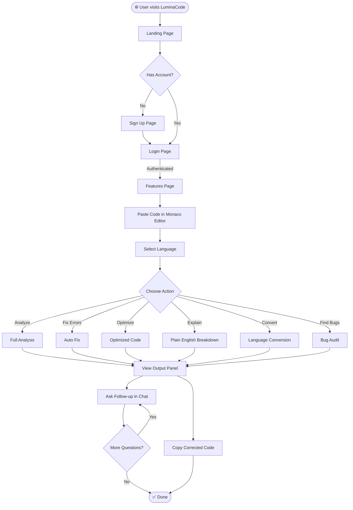
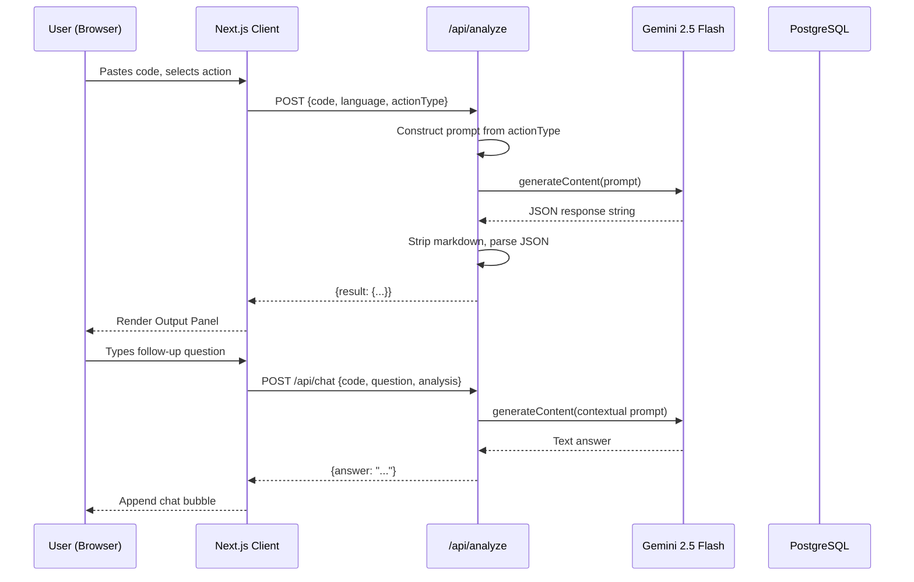

# LuminaCode — Comprehensive Project Document

> **Category:** AI / Developer Tools · **Date:** March 2026 · **Status:** MVP Complete

---

## 1. Project Title

# 🔮 LuminaCode — AI Code Intelligence Platform

*"Understand, fix, and improve your code — instantly."*

---

## 2. Problem Statement

### The Core Problem

Writing software is one of the most cognitively demanding human tasks. Developers — from beginners to senior engineers — spend an estimated **50% of their development time** debugging, reviewing, and trying to understand code rather than writing new functionality.

### Real-World Pain Points

- **Debugging is slow and manual.** Developers rely on Stack Overflow, documentation, and trial-and-error, which can take hours for a simple bug.
- **Code quality is inconsistent.** Without continuous review, developers unknowingly introduce poor practices, security vulnerabilities, and performance bottlenecks.
- **Onboarding is painful.** New team members struggle to understand existing codebases without documentation or experienced mentors available 24/7.
- **Multi-language proficiency is rare.** A Python developer converting code to Go or TypeScript must manually re-learn idioms and patterns.
- **AI tools are fragmented.** Existing tools (Copilot, ChatGPT) require context-switching — developers copy code into a chat interface, lose their editor context, and manually interpret free-text responses.

### Why This Matters

India alone produces 1.5 million engineering graduates annually. Globally, over **26.9 million software developers** write and debug code every day. A tool that reduces debugging and review time by even 30% represents an enormous productivity gain, translating to **billions of dollars** in saved developer hours.

---

## 3. Proposed Solution — Brief Overview

**LuminaCode** is a web-based AI code intelligence platform that allows developers to paste code, select an analysis action, and receive structured, actionable insights in seconds — all powered by Google Gemini 2.5 Flash.

### How It Works at a High Level

1. **User logs in** → lands on the main analyzer.
2. **Pastes code** into a Monaco Editor (the same editor powering VS Code).
3. **Selects a language** (12 options including auto-detect).
4. **Clicks an action** — Analyze, Fix Errors, Optimize, Explain, Convert, or Find Bugs.
5. **AI processes the code** → returns structured JSON with explanation, issues, suggestions, and corrected code.
6. **User copies** the corrected code or **chats with the AI** for follow-up questions in context.

The platform is fully browser-based — no installation, no setup, no IDE plugin required.

---

## 4. Opportunities & Impact

### Market Opportunity

| Segment | Size |
| :--- | :--- |
| Global Developer Population | 26.9 million (2024) |
| AI Developer Tools Market | $4.8B (2024) → projected $23B by 2030 |
| EdTech / Coding Bootcamp Market | $1.5B globally |
| Enterprise DevOps Tools Market | $12B+ |

### Direct Impact

- **Individual Developers:** Cut debugging time from hours to seconds. Get instant explanations for unfamiliar codebases.
- **Students & Learners:** Learn programming concepts with AI-generated beginner breakdowns. Receive corrections with explanations — not just answers.
- **Development Teams:** Use as a pre-commit quality gate or code review assistant.
- **Bootcamps & Educators:** Integrate as a teaching tool — students get instant, personalized feedback without waiting for instructor review.

### Indirect Impact

- Reduces burnout by removing the most frustrating parts of development.
- Democratizes access to senior-level code review for solo developers and small startups.
- Lowers the technical barrier for non-CS professionals writing scripts and automation.

---

## 5. Uniqueness & Differentiation

### How LuminaCode Differs from Existing Solutions

| Feature | LuminaCode | GitHub Copilot | ChatGPT | SonarQube |
| :--- | :--- | :--- | :--- | :--- |
| Browser-based, no install | ✅ | ❌ (IDE only) | ✅ | ❌ |
| Structured JSON output | ✅ | ❌ | ❌ | ✅ |
| 6 specialized AI actions | ✅ | ❌ | ❌ | ❌ |
| In-context follow-up chat | ✅ | ❌ | ✅ | ❌ |
| Monaco code editor built-in | ✅ | ❌ | ❌ | ❌ |
| Language conversion | ✅ | ❌ | Partial | ❌ |
| Free (hackathon MVP) | ✅ | ❌ (paid) | ❌ (limited) | ❌ (enterprise) |

### Innovative Approaches

- **Structured Generative AI Output:** Instead of free-form text, LuminaCode enforces strict JSON schema responses from Gemini using `responseMimeType: "application/json"` — making results machine-parseable and reliably structured.
- **Inverted Monaco Theme:** The editor theme inverts intelligently based on the app's light/dark mode for maximum contrast and readability.
- **Multi-Action Intelligence:** A single platform handles six distinct AI tasks without context-switching, each with a tailored prompt and output schema.
- **Animated AI Mascots:** Robot mascots visually react to AI processing state, making wait times feel dynamic and engaging — a UX differentiator in a sea of plain loading spinners.

---

## 6. How the Solution Solves the Problem

### Step-by-Step Problem Resolution

**Problem: Debugging is slow**
→ User clicks "Find Bugs" or "Fix Errors" → AI returns a list of specific bugs/vulnerabilities with explanations AND a corrected drop-in replacement code block. Zero manual searching required.

**Problem: Code quality is inconsistent**
→ User clicks "Analyze" → receives a quality score (`Correct` / `Minor Issues` / `Contains Errors`), a list of improvements, and a complexity rating (Time/Space). Acts like an instant automated code review.

**Problem: Unfamiliar code is hard to understand**
→ User clicks "Explain" → receives a beginner-friendly step-by-step breakdown of what the code does, why it's structured that way, and real-world use cases.

**Problem: Multi-language conversion is hard**
→ User selects a target language, clicks "Convert" → receives a fully idiomatic rewrite in the target language with a summary of language-specific decisions made.

**Problem: AI tools require context-switching**
→ Everything happens in one tab. The Monaco editor, action buttons, results panel, and chat interface all coexist on a single page with no copy-pasting into external tools.

**Problem: No follow-up possible after AI answers**
→ After any analysis, a "Chat with AI" panel appears. The full code and analysis are sent as context with every chat message — so the AI never loses track of what you're working on.

---

## 7. USP — Unique Selling Proposition

> **"The only AI code tool that gives you structured, actionable, multi-mode analysis inside a professional code editor — in your browser, in seconds."**

The three pillars of LuminaCode's USP:

1. **Structure over noise** — Returns parsed, formatted results (not a chat wall of text). Each action type has a dedicated, color-coded output panel.
2. **Six specialized modes in one place** — No other tool offers Analyze + Fix + Optimize + Explain + Convert + Audit in a unified, context-preserving interface.
3. **Zero friction** — No extensions, no plugins, no account setup (demo mode). Open the URL, paste code, get results.

---

## 8. Features of the System

### Core Features

| Feature | Description |
| :--- | :--- |
| **Monaco Code Editor** | VS Code-grade editor with syntax highlighting for 12 languages |
| **AI Code Analysis** | Full quality review with score, complexity, key features, bugs, and improvements |
| **AI Bug Fixer** | Auto-corrects all detected errors with a drop-in code replacement |
| **AI Optimizer** | Rewrites code for performance and readability improvements |
| **AI Explainer** | Beginner-friendly, step-by-step breakdown of any code |
| **Language Converter** | Translates code between 12 supported programming languages |
| **Bug Auditor** | Deep security and vulnerability scan with detailed issue listing |
| **Contextual AI Chat** | Follow-up Q&A with full code + analysis context preserved |
| **Copy to Clipboard** | One-click copy of AI-generated corrected code |
| **Language Selector** | Pill-based selector for 12 languages + Auto Detect |
| **Typewriter Output** | AI results stream character-by-character for dynamic feel |
| **Light / Dark Mode** | System-aware theme with smooth transition |
| **Command Palette** | `Ctrl+K` spotlight search for navigation and theme toggle |
| **Animated Robot Mascots** | Visual AI state indicator — reacts during processing |
| **Status Quality Badge** | Color-coded quality badge (Good / Needs Action / Poor) |
| **Review Status Indicators** | Per-error bullet list for detected bugs and vulnerabilities |
| **User Authentication** | Login / Signup flow with NextAuth JWT sessions |
| **Feedback System** | Star rating + quick reply + text feedback submission |
| **Help Center** | Searchable FAQ with AI assistant persona and animated accordion |

### Design Features

- Glassmorphism UI with wine red, matcha green, and gold accent palette
- Framer Motion animations throughout (hero, cards, robot, output reveals)
- Fully responsive — works on desktop, tablet, and mobile
- Four typography layers: Geist Sans, Playfair Display, JetBrains Mono, Geist Mono

---

## 9. Architecture & Diagrams

### 9.1 System Architecture

```mermaid
graph TB
    subgraph Client["🖥️ Browser (React / Next.js)"]
        A[Landing Page] --> B[Login / Signup]
        B --> C[Features Page - Monaco Editor]
        C --> D[Help Page]
        C --> E[Feedback Page]
    end

    subgraph Server["⚙️ Next.js API Routes (Serverless)"]
        F[/api/analyze]
        G[/api/chat]
        H[/api/auth/nextauth]
        I[/api/login]
        J[/api/signup]
    end

    subgraph AI["🤖 Google Gemini 2.5 Flash"]
        K[Analyze Engine]
        L[Chat Engine]
    end

    subgraph DB["🗄️ PostgreSQL via Prisma"]
        M[(User Table)]
        N[(ReviewHistory Table)]
    end

    C -->|POST code + action| F
    C -->|POST code + question| G
    B -->|Credentials| H
    F --> K
    G --> L
    K -->|JSON result| F
    L -->|Text answer| G
    H --> M
    F -.->|Future: save| N
```

### 9.2 User Flow Diagram



### 9.3 Data Flow Diagram



---

## 10. Technologies Used

### Frontend
| Technology | Version | Purpose |
| :--- | :--- | :--- |
| Next.js | 16.2.1 | Full-stack React framework (App Router) |
| React | 19.2.4 | UI library |
| TypeScript | 5.x | Type-safe JavaScript |
| Tailwind CSS | 4.x | Utility-first CSS framework |
| Framer Motion | 12.x | Animations and transitions |
| Lucide Icons | 1.x | Icon library |
| `@monaco-editor/react` | 4.7 | VS Code Monaco editor component |
| `next-themes` | 0.4.6 | Dark/light theme management |
| `cmdk` | 1.x | Command palette UI |
| `mermaid` | 11.x | Diagram rendering |
| `html2canvas` | 1.4 | DOM-to-image capture |

### Backend & AI
| Technology | Version | Purpose |
| :--- | :--- | :--- |
| Next.js API Routes | 16.2.1 | Serverless backend |
| `@google/generative-ai` | 0.24.1 | Gemini AI SDK |
| `@google/genai` | 1.46.0 | Advanced Gemini SDK |
| Google Gemini 2.5 Flash | — | AI code intelligence model |

### Database & Auth
| Technology | Version | Purpose |
| :--- | :--- | :--- |
| Prisma ORM | 7.5 | Type-safe database client |
| PostgreSQL | — | Relational database |
| MongoDB (via native driver) | — | Secondary DB (user auth) |
| NextAuth.js | 4.24 | Authentication (JWT sessions) |

### Fonts
| Font | Purpose |
| :--- | :--- |
| Geist Sans | Primary UI font (Google) |
| Geist Mono | Monospaced UI elements |
| Playfair Display | Styled serif headings |
| JetBrains Mono | Code editor font |

### DevOps & Tooling
| Tool | Purpose |
| :--- | :--- |
| Vercel | Deployment platform |
| ESLint | Code linting |
| PostCSS | CSS processing |
| Git / GitHub | Version control |

---

## 11. Estimated Implementation Cost

### Development Cost (1 Developer, ~4 weeks)

| Phase | Effort | Est. Cost (Freelance Rate ₹1500/hr) |
| :--- | :--- | :--- |
| UI/UX Design & Prototyping | 20 hrs | ₹30,000 |
| Frontend Development | 40 hrs | ₹60,000 |
| API Route Development | 20 hrs | ₹30,000 |
| AI Prompt Engineering | 10 hrs | ₹15,000 |
| Auth & Database Integration | 15 hrs | ₹22,500 |
| Testing & Deployment | 10 hrs | ₹15,000 |
| **Total Development** | **115 hrs** | **₹1,72,500** |

### Ongoing Monthly Operational Cost (Post-MVP)

| Resource | Details | Cost/Month |
| :--- | :--- | :--- |
| **Vercel Pro** | Hosting, serverless functions, CDN | ~$20 (₹1,660) |
| **Google Gemini API** | ~50,000 requests @ $0.075/1M tokens (Flash) | ~$10–50 (₹830–4,150) |
| **PostgreSQL** (Supabase Free) | Up to 500MB, 2 projects | Free |
| **MongoDB Atlas** (Free Tier) | 512MB storage | Free |
| **Domain** (annual) | `.ai` domain | ~$50/yr (₹4,150/yr) |
| **Total Monthly (Low Traffic)** | — | **~₹2,500–6,000/month** |

> At scale (10,000+ daily users), Gemini API costs would be the primary variable cost. Caching frequent queries with Redis would significantly reduce this.

---

## 12. MVP Description & Screenshots

### MVP Scope

The current MVP delivers the core value proposition end-to-end:

#### ✅ Implemented in MVP

**Page 1 — Landing (`/`)**
- Animated hero robot with glowing orb background
- Feature strip (5 capability cards)
- "How it works" 3-step workflow visual
- "Why LuminaCode" section with animated icons
- CTA buttons linking to the analyzer

**Page 2 — Features Analyzer (`/features`)**
- Monaco Editor with JetBrains Mono font, inverted theme, 12-language support
- 6 action buttons: Analyze, Fix Errors, Optimize, Explain, Convert, Find Bugs
- AI thinking state with animated dots and action-aware label
- Dynamic output panel with color-coded border per action type
- Quality badge (Good / Needs Action / Poor) for Analyze/Audit
- AI-generated corrected code Monaco viewer with copy button
- Chat with AI section (appears post-analysis)
- Animated robot mascots (left + right) reacting to AI state

**Page 3 — Help (`/help`)**
- AI assistant header with pulsing bot icon
- Real-time search bar filtering FAQ cards
- 4 animated accordion FAQ cards
- Quick Demo CTA linking to `/features`

**Page 4 — Feedback (`/feedback`)**
- 5-star rating system
- 4 quick-reply toggle chips
- Free-text textarea
- Animated success state with bot icon

**Auth Pages — Login & Signup**
- Simple credential forms
- JWT session via NextAuth
- Redirect to analyzer on login

**Global**
- `Ctrl+K` Command Palette with navigation + theme toggle
- Light/dark mode with smooth transition and persistent preference
- Fully responsive layout
- Glassmorphism panels, gradient glows, wine red/matcha/gold palette

#### 🔄 Not in MVP (Planned)

- Review history persistence to DB
- Real user registration to PostgreSQL
- Multi-agent parallel analysis (Sentinel + Architect + Strategist)
- Mermaid diagram generation from code
- Feedback data persistence
- Rate limiting and abuse prevention

---

## 13. Additional Details

### Authentication Note
The system uses **NextAuth.js** for session management (JWT strategy). For the hackathon MVP, a hardcoded mock user (`developer@luminacode.ai` / `password`) is used so judges can demo instantly without registering. Real user auth (bcrypt hashed passwords, DB-stored users) is architecturally ready via the Prisma `User` model.

### Database Dual-Layer Architecture
The project uses both **MongoDB** (for flexible user document storage via native driver, [src/lib/mongodb.ts](file:///c:/Users/Priya%20Yadav/Desktop/website/src/lib/mongodb.ts)) and **PostgreSQL** (via Prisma for structured relational data — `User` + `ReviewHistory`). This dual-DB approach gives flexibility: MongoDB for fast user writes, PostgreSQL for structured analytical queries.

### AI Response Reliability
Gemini 2.5 Flash's `responseMimeType: "application/json"` mode ensures the model outputs strict JSON without markdown wrappers. An additional cleanup regex removes any residual fences before parsing. This two-layer approach makes AI responses very reliable in production.

### Design Philosophy
The brand palette — **wine red, matcha green, and gold** — is intentionally premium and non-standard for developer tools (which typically default to plain blue). Paired with Playfair Display serif typography, the design conveys intelligence, prestige, and craftsmanship — differentiating LuminaCode visually from GitHub Copilot, ChatGPT, and SonarQube.

---

## 14. Future Scope & Enhancements

### Phase 2 — Persistence & History (3–4 months)
- Save all analysis results to `ReviewHistory` table per user
- `/history` page with searchable, filterable past analyses
- User dashboard showing code quality trends over time
- Export history as PDF reports

### Phase 3 — Multi-Agent Intelligence (4–6 months)
Implement the three-agent pipeline already reflected in the DB schema:
- **Sentinel Agent** — Focused on bugs and security vulnerabilities
- **Architect Agent** — Focused on architectural patterns and optimization
- **Strategist Agent** — Focused on business logic, best practices, and scalability advice
- All three run in parallel (`Promise.all`) and results render in tabbed panels

### Phase 4 — IDE Extensions (6–9 months)
- VS Code extension that sends selected code to LuminaCode without leaving the IDE
- JetBrains plugin (IntelliJ, PyCharm)
- CLI tool (`luminacode analyze ./src/index.js`)

### Phase 5 — Team Collaboration (9–12 months)
- Shared workspaces — teams analyze and comment on code together
- GitHub/GitLab integration — PR-level code review automation
- Organization dashboards with aggregate code quality metrics
- Role-based access control (Admin, Developer, Viewer)

### Phase 6 — Monetization (12+ months)
| Tier | Price | Features |
| :--- | :--- | :--- |
| **Free** | ₹0 | 20 analyses/day, 3 languages |
| **Pro** | ₹499/month | Unlimited analyses, all languages, history |
| **Team** | ₹1,999/month | 5 seats, shared workspace, GitHub integration |
| **Enterprise** | Custom | SSO, private deployment, SLA, custom models |

### Technical Enhancements
- **Streaming responses** — Switch from `generateContent` to `generateContentStream` for real-time token streaming
- **Redis caching** — Cache identical code+action pairs to reduce API costs
- **Rate limiting** — Per-user request throttling using Upstash Redis
- **Mermaid diagram generation** — AI generates architecture/flowchart diagrams from code
- **Vulnerability database integration** — Cross-reference detected issues against CVE databases
- **Mobile app** — React Native wrapper (Expo) for iOS and Android

---

*Document prepared for LuminaCode · March 2026 · Built with ❤️ using Next.js & Google Gemini*
